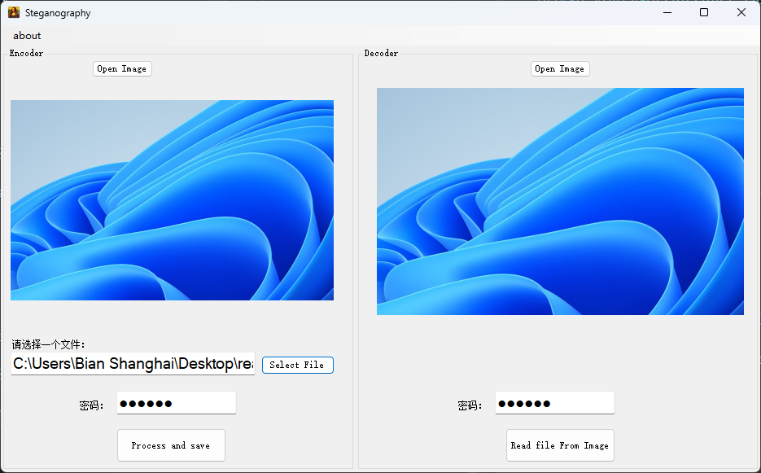

<h1 align="center">Steganography</h1>

Embedding a micro file in cover images using Least Significant Bits (LSB) technique written in C#. 
Insert hidden information in image's pixels and extract it later.

将一个微小文件嵌入到封面图像中，使用最低有效位（LSB）技术编写的C#程序。
将隐藏信息插入到图像的像素中，以后可以提取它。

## Features
- Embed a micro file in an image
- Extract a micro file from an image
- Support aes encryption

## How to use

1. Clone the repository
2. Run the project in Visual Studio
3. Select the image you want to hide the file in
4. Select a micro file you want to hide
5. Click on `Process and save` button to save the new image
6. Select the image you want to extract the file from
7. Click on `Read file From Image` button

## License
MIT

## References
- [Least Significant Bit](https://en.wikipedia.org/wiki/Least_significant_bit)
- [Steganography](https://en.wikipedia.org/wiki/Steganography)
- [Steganography in C#](https://github.com/SajjadAemmi/Steganography)
